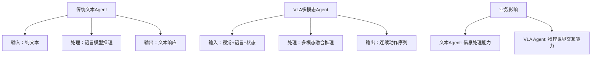

# VLA架构对Agent系统设计的启发与扩展

> **研究背景**: 基于Physical Intelligence OpenPI项目的深度分析，从VLA (Vision-Language-Action) 统一建模中提取对传统Agent系统设计的重要启发和扩展价值。

## 🎯 核心价值洞察

### 从文本Agent到多模态Agent的范式转换

**传统Agent局限性分析**：


**VLA架构的突破性价值**：
1. **感知能力升级**：从单一文本理解到视觉-语言-状态的综合感知
2. **决策空间扩展**：从离散的文本输出到连续的动作控制
3. **交互模式革新**：从纯信息交换到物理世界的直接干预
4. **应用场景跃升**：从虚拟助手到具身智能的全面升级

## 🏗️ 架构设计启发

### 1. 统一表示学习的Agent设计思维

#### 传统Agent的模态分离问题
```python
# 传统Agent架构的模态割裂
class TraditionalAgent:
    def __init__(self):
        self.text_processor = TextProcessor()
        self.image_analyzer = ImageAnalyzer()  # 独立模块
        self.action_planner = ActionPlanner()  # 独立模块

    def process(self, inputs):
        # 各模态独立处理，缺乏深度融合
        text_result = self.text_processor(inputs['text'])
        image_result = self.image_analyzer(inputs['image'])
        # 简单拼接，缺乏统一表示
        return self.combine_results(text_result, image_result)
```

#### VLA启发的统一Agent架构
```python
# VLA启发的统一表示Agent
class UnifiedModalAgent:
    def __init__(self):
        # 核心创新：统一的多模态编码器
        self.unified_encoder = UnifiedModalEncoder()
        self.cross_modal_attention = CrossModalAttention()
        self.unified_decoder = UnifiedDecoder()

    def process(self, multi_modal_inputs):
        # 统一编码：所有模态映射到共同表示空间
        unified_features = self.unified_encoder(multi_modal_inputs)

        # 跨模态融合：注意力机制实现深度交互
        fused_representation = self.cross_modal_attention(unified_features)

        # 统一解码：从统一表示到任务特定输出
        return self.unified_decoder(fused_representation)
```

**设计原则提炼**：
- **表示统一性**：不同模态信息映射到统一的语义空间
- **交互深度性**：跨模态特征的深度交互而非简单拼接
- **解码灵活性**：统一表示支持多种任务的灵活解码

### 2. Knowledge Insulation在业务Agent中的应用

#### 多业务Agent的知识隔离挑战
在企业环境中，一个Agent系统往往需要处理多个业务领域，如客服、营销、技术支持等。传统方法面临：
- **灾难性遗忘**：学习新业务时遗忘已掌握的业务知识
- **知识污染**：不同业务领域的知识相互干扰
- **专业性下降**：通用模型在专业领域的能力不足

#### VLA Knowledge Insulation的启发方案
```python
class BusinessDomainAgent:
    def __init__(self, domains=['customer_service', 'marketing', 'tech_support']):
        # 领域路由器：智能识别业务领域
        self.domain_router = DomainRouter(domains)

        # 领域专家网络：每个业务领域的专门知识
        self.domain_experts = {
            domain: DomainExpertNetwork(domain)
            for domain in domains
        }

        # 知识隔离层：防止跨域知识污染
        self.knowledge_isolation = KnowledgeIsolationLayer()

        # 共享基础能力：跨域通用能力
        self.shared_foundation = SharedFoundationModel()

    def process(self, query, context):
        # 1. 领域识别
        domain = self.domain_router.identify_domain(query, context)

        # 2. 专家网络激活
        domain_expert = self.domain_experts[domain]

        # 3. 知识隔离处理
        isolated_knowledge = self.knowledge_isolation.isolate(
            domain_expert, query, context
        )

        # 4. 基础能力融合
        foundation_support = self.shared_foundation.enhance(isolated_knowledge)

        return self.generate_response(foundation_support, domain)
```

**业务价值**：
- **专业性保证**：每个业务领域保持专业的知识深度
- **学习效率**：新业务学习不影响已有业务能力
- **系统稳定性**：避免模型更新导致的整体性能下降
- **资源优化**：按需激活相关业务专家，提高计算效率

### 3. Flow Matching在Agent决策中的创新应用

#### 传统Agent决策的离散化限制
```python
# 传统离散决策Agent
class DiscreteDecisionAgent:
    def decide(self, state):
        # 决策空间被人为离散化
        actions = ['action_a', 'action_b', 'action_c']
        probabilities = self.policy_network(state)
        # 硬性选择，缺乏平滑过渡
        return actions[np.argmax(probabilities)]
```

#### Flow Matching启发的连续决策机制
```python
class ContinuousDecisionAgent:
    def __init__(self):
        # Flow Matching核心：学习决策向量场
        self.decision_flow_network = DecisionFlowNetwork()
        self.context_encoder = ContextEncoder()

    def decide(self, state, context):
        # 编码当前状态和上下文
        encoded_context = self.context_encoder(state, context)

        # Flow Matching决策生成
        decision_trajectory = self.generate_decision_flow(encoded_context)

        return decision_trajectory

    def generate_decision_flow(self, context, num_steps=10):
        """Flow Matching决策生成过程"""
        # 从随机噪声开始
        decision = torch.randn(self.decision_dim)
        dt = 1.0 / num_steps

        for step in range(num_steps):
            t = step * dt
            # 学习的向量场指导决策演化
            velocity = self.decision_flow_network(decision, t, context)
            decision = decision + velocity * dt

        return decision
```

**应用场景扩展**：
- **参数优化Agent**：连续调整系统参数的AI Assistant
- **资源分配Agent**：平滑的资源分配决策，避免剧烈波动
- **交互策略Agent**：连续调整对话策略，提供更自然的交互体验

## 💡 企业级Agent系统设计的新思路

### 1. 大规模预训练Agent的工程化

#### 数据工程启发
基于OpenPI 10k+小时训练数据的经验：

```python
class EnterpriseAgentDataPipeline:
    def __init__(self):
        # 多源数据整合
        self.data_sources = {
            'conversation_logs': ConversationDataProcessor(),
            'business_documents': DocumentDataProcessor(),
            'user_feedback': FeedbackDataProcessor(),
            'system_metrics': MetricsDataProcessor()
        }

        # 数据质量控制
        self.quality_controller = DataQualityController()

        # 隐私保护处理
        self.privacy_protector = PrivacyProtector()

    def create_training_dataset(self):
        """创建企业级Agent训练数据集"""
        raw_data = self.collect_multi_source_data()

        # 数据标准化和对齐
        aligned_data = self.align_multi_modal_data(raw_data)

        # 质量筛选和清洗
        clean_data = self.quality_controller.filter_and_clean(aligned_data)

        # 隐私保护和脱敏
        protected_data = self.privacy_protector.anonymize(clean_data)

        # 数据增强和平衡
        augmented_data = self.augment_and_balance(protected_data)

        return augmented_data
```

#### 分布式训练架构
```python
class DistributedAgentTraining:
    def __init__(self):
        # FSDP分片策略
        self.fsdp_config = {
            'sharding_strategy': 'FULL_SHARD',
            'mixed_precision': 'bf16',
            'gradient_checkpointing': True
        }

        # 模型并行配置
        self.model_parallel_config = {
            'tensor_parallel_size': 4,
            'pipeline_parallel_size': 2
        }

    def setup_distributed_training(self, agent_model):
        """设置分布式Agent训练"""
        # 模型分片
        sharded_model = self.apply_fsdp_sharding(agent_model)

        # 数据并行
        parallel_dataloader = self.setup_data_parallel()

        # 梯度同步优化
        optimized_sync = self.optimize_gradient_sync()

        return sharded_model, parallel_dataloader, optimized_sync
```

### 2. 生产级Agent系统的可观测性

#### VLA启发的多维度监控
```python
class AgentObservabilitySystem:
    def __init__(self):
        # 多模态性能监控
        self.performance_monitor = MultiModalPerformanceMonitor()

        # 决策轨迹追踪
        self.decision_tracer = DecisionTrajectoryTracer()

        # 知识隔离效果监控
        self.isolation_monitor = KnowledgeIsolationMonitor()

    def monitor_agent_performance(self, agent_instance):
        """全方位Agent性能监控"""
        metrics = {
            # 基础性能指标
            'response_latency': self.measure_response_time(),
            'throughput': self.measure_throughput(),
            'resource_usage': self.measure_resource_consumption(),

            # VLA特有指标
            'modal_fusion_quality': self.assess_modal_fusion(),
            'decision_smoothness': self.measure_decision_continuity(),
            'knowledge_isolation_effectiveness': self.assess_isolation(),

            # 业务指标
            'task_success_rate': self.measure_task_completion(),
            'user_satisfaction': self.collect_feedback_scores(),
            'business_value_created': self.quantify_business_impact()
        }

        return metrics
```

### 3. Agent系统的安全性和可靠性增强

#### 基于VLA经验的安全机制
```python
class SecureAgentSystem:
    def __init__(self):
        # 输入验证和净化
        self.input_sanitizer = MultiModalInputSanitizer()

        # 输出安全检查
        self.output_validator = OutputSafetyValidator()

        # 行为边界控制
        self.behavior_controller = BehaviorBoundaryController()

    def safe_agent_execution(self, agent, inputs):
        """安全的Agent执行流程"""
        # 1. 输入安全检查
        sanitized_inputs = self.input_sanitizer.sanitize(inputs)

        # 2. 执行边界控制
        with self.behavior_controller.constrain():
            agent_outputs = agent.process(sanitized_inputs)

        # 3. 输出安全验证
        validated_outputs = self.output_validator.validate(agent_outputs)

        # 4. 审计日志记录
        self.audit_logger.log_execution(inputs, validated_outputs)

        return validated_outputs
```

## 🚀 实施路径与最佳实践

### 1. 渐进式Agent能力升级路径

#### 阶段1：多模态感知增强
```python
# 当前文本Agent → 多模态感知Agent
class ModalUpgradePlan:
    def phase1_multimodal_perception(self):
        return {
            '目标': '为现有Agent增加视觉和语音理解能力',
            '技术路径': [
                '集成预训练的视觉编码器（ViT、CLIP等）',
                '添加语音识别和理解模块',
                '开发跨模态注意力机制',
                '建立统一的多模态表示空间'
            ],
            '预期收益': [
                '理解用户上传的图片和文档',
                '处理语音输入和多媒体内容',
                '提供更丰富的交互体验'
            ]
        }
```

#### 阶段2：连续决策能力建设
```python
    def phase2_continuous_decision(self):
        return {
            '目标': '从离散选择升级到连续参数优化',
            '技术路径': [
                '实现Flow Matching决策机制',
                '开发连续动作空间建模',
                '建立平滑的策略调整机制',
                '优化决策轨迹生成算法'
            ],
            '应用场景': [
                '动态调整服务策略参数',
                '连续优化推荐算法权重',
                '平滑调节系统配置参数'
            ]
        }
```

#### 阶段3：知识隔离与专业化
```python
    def phase3_knowledge_specialization(self):
        return {
            '目标': '建立多业务领域的专业化Agent能力',
            '技术路径': [
                '实现Knowledge Insulation机制',
                '开发领域特定专家网络',
                '建立领域路由和切换机制',
                '优化跨域知识迁移策略'
            ],
            '业务价值': [
                '保持各业务领域的专业性',
                '支持新业务的快速扩展',
                '避免业务间的相互干扰'
            ]
        }
```

### 2. 技术选型与集成建议

#### 开源技术栈推荐
```python
class TechStackRecommendation:
    def __init__(self):
        self.recommended_stack = {
            # 多模态处理
            'vision_processing': {
                'primary': 'transformers (HuggingFace)',
                'models': ['CLIP', 'ViT', 'DETR'],
                'frameworks': ['PyTorch', 'JAX/Flax']
            },

            # Flow Matching实现
            'continuous_modeling': {
                'libraries': ['torchdiffeq', 'diffrax (JAX)'],
                'neural_ode': ['torchdyn', 'neural-diffeq'],
                'sampling': ['SciPy', 'JAX.scipy']
            },

            # 分布式训练
            'distributed_training': {
                'data_parallel': ['PyTorch DDP', 'JAX pmap'],
                'model_parallel': ['FairScale FSDP', 'JAX mesh'],
                'optimization': ['DeepSpeed', 'Megatron-LM']
            },

            # 部署服务
            'deployment': {
                'serving': ['FastAPI', 'gRPC', 'WebSocket'],
                'containerization': ['Docker', 'Kubernetes'],
                'monitoring': ['Prometheus', 'Grafana', 'Jaeger']
            }
        }
```

#### 集成架构设计
```python
class IntegratedAgentArchitecture:
    def design_production_architecture(self):
        return {
            # 服务层架构
            'service_layer': {
                'api_gateway': 'Kong/Istio统一入口',
                'load_balancer': 'HAProxy/Nginx负载均衡',
                'service_mesh': 'Istio服务治理'
            },

            # 应用层架构
            'application_layer': {
                'agent_engine': 'VLA统一推理引擎',
                'domain_router': '业务领域路由服务',
                'knowledge_store': '分布式知识存储'
            },

            # 数据层架构
            'data_layer': {
                'training_data': 'HDFS/S3海量数据存储',
                'model_registry': 'MLflow模型版本管理',
                'feature_store': 'Feast特征管理'
            },

            # 基础设施层
            'infrastructure_layer': {
                'compute': 'Kubernetes/GPU集群',
                'storage': '分布式存储集群',
                'network': 'SDN网络架构'
            }
        }
```

## 📊 ROI评估与业务价值

### 1. 技术投入回报分析

#### 投入成本结构
```python
class ROIAnalysis:
    def calculate_investment_cost(self):
        return {
            # 研发投入
            'development_cost': {
                '算法研究': '6个月 * 3人 * 月薪',
                '工程开发': '4个月 * 5人 * 月薪',
                '测试验证': '2个月 * 2人 * 月薪'
            },

            # 基础设施投入
            'infrastructure_cost': {
                'GPU集群': '8 * A100 * 12个月租金',
                '存储系统': '100TB * 存储单价',
                '网络带宽': '高速网络 * 年费用'
            },

            # 运营成本
            'operational_cost': {
                '模型训练': '电力 + 人工监控',
                '系统维护': '运维人员 + SLA保证',
                '持续优化': '算法优化 + 性能调优'
            }
        }

    def estimate_business_returns(self):
        return {
            # 效率提升收益
            'efficiency_gains': {
                '响应速度提升': '50% → 用户满意度提升',
                '处理能力增强': '3倍吞吐量 → 服务更多用户',
                '准确率改善': '15% → 减少人工介入成本'
            },

            # 新业务机会
            'new_opportunities': {
                '多模态服务': '图像/语音处理新业务',
                '智能决策': '连续优化服务',
                '专业化服务': '多领域专家服务'
            },

            # 成本节约
            'cost_savings': {
                '人工成本': '减少50%重复性工作',
                '系统维护': '自动化运维降本',
                '错误成本': '减少决策错误损失'
            }
        }
```

### 2. 实施风险与缓解策略

#### 技术风险管控
```python
class RiskMitigation:
    def technical_risks(self):
        return {
            '技术复杂度高': {
                '风险': 'VLA技术门槛高，团队掌握困难',
                '缓解': '分阶段实施，先简单后复杂，外部专家指导'
            },

            '性能不达预期': {
                '风险': '多模态融合效果不如预期',
                '缓解': '建立详细的评测基准，持续A/B测试优化'
            },

            '集成复杂度': {
                '风险': '与现有系统集成困难',
                '缓解': '设计适配层，渐进式替换现有组件'
            }
        }

    def business_risks(self):
        return {
            '投资回收期长': {
                '风险': 'ROI实现时间超出预期',
                '缓解': '设定明确的阶段性目标和收益指标'
            },

            '用户接受度': {
                '风险': '用户对新技术接受度不高',
                '缓解': '充分的用户教育和渐进式功能发布'
            },

            '竞争压力': {
                '风险': '竞争对手技术快速迭代',
                '缓解': '保持技术领先，建立技术护城河'
            }
        }
```

## 🎯 总结与行动建议

### 核心价值总结
1. **架构范式升级**：从单模态文本Agent到多模态统一Agent的架构跃升
2. **决策能力增强**：从离散选择到连续优化的决策能力扩展
3. **知识管理创新**：Knowledge Insulation解决多业务Agent的知识冲突
4. **工程实践进化**：大规模分布式训练和生产级部署的完整方案

### 立即行动建议
1. **技术调研启动**：组织团队深度研究VLA相关技术和开源实现
2. **原型验证**：选择一个具体业务场景进行VLA Agent原型开发
3. **基础设施评估**：评估现有基础设施对VLA技术的支撑能力
4. **人才储备**：培养或招募多模态AI和分布式训练相关技术人才

### 长期战略规划
- **Q4 2025**：完成VLA Agent技术原型和小规模验证
- **Q1-Q2 2026**：在核心业务场景实现VLA Agent部署
- **Q3-Q4 2026**：扩展到多业务领域，建立Knowledge Insulation体系
- **2027年**：形成完整的多模态Agent技术平台和生态

---

**相关文档链接**：
- **架构深度分析**：[Project/Repository/openpi-2025-09-30/01-核心架构分析](/tags/Project/Repository/openpi-2025-09-30/01-核心架构分析/)
- **技术创新解析**：[Project/Repository/openpi-2025-09-30/02-技术创新解析](/tags/Project/Repository/openpi-2025-09-30/02-技术创新解析/)
- **工程实践总结**：[Project/Repository/openpi-2025-09-30/03-工程实践总结](/tags/Project/Repository/openpi-2025-09-30/03-工程实践总结/)
- **Agent调研导航**：[Agent调研知识地图MOC](/tags/Agent调研知识地图MOC/)

#claude-note #agent-research #vla-architecture #embodied-intelligence #multi-modal-agent