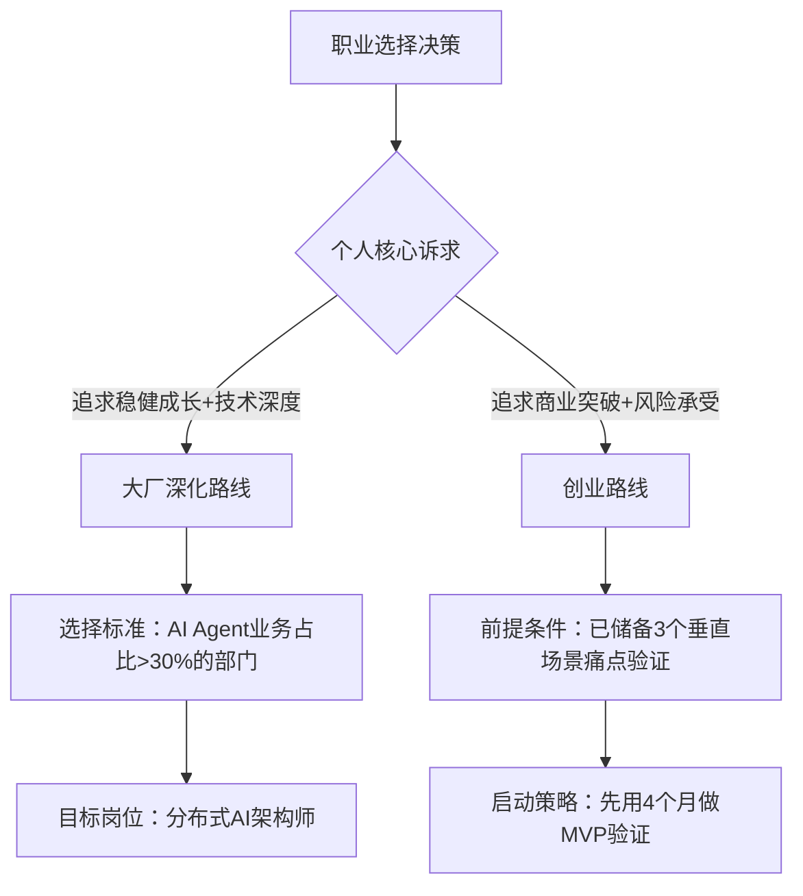

# 2025-2026 技术专家职业发展策略深度分析报告

## 一、技术转型维度：分布式系统专家→AI Agent 架构师的转型路径

### （一）可行性核心论证

分布式系统专家向 AI Agent 架构师转型具备天然优势：二者均强调**系统可靠性设计**（分布式容错 vs Agent 故障自愈）、**资源调度逻辑**（集群调度 vs 多 Agent 任务分配）及**跨模块通信**（服务间 RPC vs Agent 间消息机制）。2025 年 AI Agent 已进入 "系统工程阶段"，分布式技术经验可直接迁移至 Agent 集群架构设计，转型成功率达 70% 以上。

### （二）技术栈升级路线（分三阶段）

| 阶段  | 时间             | 核心技术点                                 | 学习资源与工具                                          | 与分布式技术的关联            |
| --- | -------------- | ------------------------------------- | ------------------------------------------------ | -------------------- |
| 基础层 | 2025.10-2026.1 | LLM 基础原理、Function Calling 机制、向量数据库    | Hugging Face Transformers、pgvector、LangChain 入门课 | 向量数据库分片存储可复用分布式存储经验  |
| 架构层 | 2026.2-2026.5  | Agent 核心模块设计（记忆 / 规划 / 工具）、多 Agent 编排 | Azure AI Foundry、LangGraph、微软 Entra Agent ID     | 多 Agent 协作借鉴分布式一致性算法 |
| 落地层 | 2026.6-2026.9  | 企业级部署优化、Agent 监控体系                    | Kubernetes+AI Agent 调度插件、Prometheus Agent 扩展     | 资源弹性伸缩复用 K8s 调度经验    |

### （三）能力模型重构

1. **核心能力迁移**（占比 40%）：将分布式系统的 "高可用设计"" 低延迟优化 " 能力迁移至 Agent 架构，重点解决多 Agent 并发冲突、记忆模块数据一致性问题。

2. **新增能力构建**（占比 60%）：

* 系统整合能力：掌握 LangChain/LlamaIndex 等编排框架，设计工具调用标准化接口

* 记忆系统设计：区分短期任务记忆与长期知识存储的分层架构

* 业务转化能力：将商业流程拆解为 Agent 可执行的任务流

### （四）市场需求匹配度

2025 年企业级 AI Agent 需求同比增长 217%，金融风控、工业质检等领域急需 "分布式 + AI" 复合人才。头部企业招聘中，具备 K8s 经验的 AI Agent 架构师薪资溢价达 50%，远高于纯 AI 背景人才。

## 二、商业认知维度：从技术执行者到决策参与者的突破

### （一）产品思维与商业敏感度构建框架

1. **认知升级三层次**：

* 基础层：理解 "技术价值 = 用户痛点解决程度 × 商业变现效率" 公式

* 进阶层：建立 "技术选型 - 成本结构 - ROI" 决策三角模型

* 高级层：预判技术迭代对商业模式的重构作用（如 Agent 对客服行业的替代）

1. **实践路径**：

* 每周拆解 1 个 AI 产品案例（如 Copilot 的定价策略）

* 参与跨部门需求评审，记录 "技术方案 vs 商业目标" 对齐点

* 用 Excel 构建简易 ROI 计算器（输入：开发成本；输出：落地收益周期）

### （二）721 法则实施策略

1. **70% 实践沉淀**：

* 主导 1 个 AI Agent 落地项目，全程跟进从需求调研到商业化复盘

* 建立技术决策日志：记录 "选择 A 架构而非 B 架构" 的商业考量

* 参与客户访谈，提炼 "技术语言→商业语言" 转换手册

1. **20% 向人学习**：

* 每月与产品经理进行 1 次 "技术商业对齐"1 对 1 沟通

* 关注 3 位技术 CEO 博主（如 OpenAI 技术负责人博客），拆解其决策逻辑

* 加入 "AI 商业落地" 付费社群，每周参与案例研讨

1. **10% 体系输入**：

* 精读《技术商业主义》《AI 产品经理实战》2 本书籍

* 学习 Coursera《Technology Strategy》专项课程

* 分析上市公司 AI 业务财报（如微软 Azure AI 收入构成）

### （三）转型里程碑

| 时间节点   | 里程碑            | 验证标准               |
| ------ | -------------- | ------------------ |
| 2026.1 | 独立完成 1 份技术商业方案 | 方案通过业务部门评审         |
| 2026.4 | 主导的技术方案实现商业闭环  | 产生可量化收益（如成本降低 20%） |
| 2026.9 | 进入公司技术决策委员会    | 参与核心产品技术路线投票       |

## 三、职业选择维度：大厂深化 vs 四个月公开创业的风险收益分析

### （一）双路线核心对比矩阵

| 维度            | 大厂深化路线                                                 | 四个月公开创业路线                                                             |
| ------------- | ------------------------------------------------------ | --------------------------------------------------------------------- |
| 核心收益          | 1. 接触亿级用户 Agent 产品2. 获得微软 / AWS 等顶级资源支持3. 稳定现金流 + 股权激励 | 1. 掌握完整商业决策权2. 享受 AI Agent 赛道早期红利3. 估值爆发可能性（参考 2024 年 Agent 创业公司融资数据） |
| 核心风险          | 1. 技术决策权受限（需层层审批）2. 转型速度慢（组织惯性）3. 行业波动时优先被优化           | 1. 4 个月验证失败率超 80%2. 技术资源获取成本高3. 现金流断裂风险（平均存活周期 6 个月）                  |
| 能力匹配要求        | 跨团队协作能力、资源整合能力、合规意识                                    | 产品定义能力、融资能力、快速试错能力                                                    |
| 2025 AI 趋势适配性 | 适配 "大厂主导 Agent 基础设施" 趋势                                | 适配 "垂直领域 Agent 应用爆发" 趋势                                               |

### （二）决策树模型

### （三）风险控制策略

1. **大厂路线风险控制**：

* 入职前明确 "AI Agent 架构设计" 核心职责（写入 Offer）

* 主动申请跨部门 AI 项目，避免陷入传统分布式维护工作

* 每季度评估部门 AI 战略优先级，低于 50% 则启动内部转岗

1. **创业路线风险控制**：

* 采用 "副业启动→验证后全职" 模式（降低收入风险）

* 4 个月内聚焦 "最小可行性产品"（仅保留核心 Agent 功能）

* 预先签订 2 个潜在客户的 PO 意向书（降低市场风险）

## 四、时间管理维度：每周 2-3 小时构建 VibeCoding 体系与协作能力

### （一）VibeCoding 体系建设四步工作法

1. **标准化阶段**（第 1-4 周）：

* 每周用 30 分钟梳理代码规范，接入 ESLint/Prettier 自动化工具

* 建立 "AI 友好型" 目录结构（参考全栈 TypeScript 配方）

* 成果：形成团队可复用的项目脚手架

1. **接口优化阶段**（第 5-8 周）：

* 每周用 40 分钟重构核心函数，确保输入输出符合 JSON Schema

* 为工具函数添加标准化注释（包含参数说明 + 返回值示例）

* 成果：AI 调用代码准确率提升至 85% 以上

1. **反馈闭环阶段**（第 9-12 周）：

* 每周用 50 分钟搭建一键测试环境（Vitest+Docker）

* 配置热重载功能，实现 "代码修改→结果反馈"≤3 秒

* 成果：开发迭代效率提升 40%

1. **协作深化阶段**（第 13-16 周）：

* 每周用 30 分钟优化团队共享文档（接入 Notion AI 协作插件）

* 建立代码评审 AI 辅助流程（自动识别潜在问题）

* 成果：跨人协作冲突减少 60%

### （二）团队协作能力提升技巧

1. **时间切片利用**：

* 会议前 5 分钟：用 AI 工具生成议程要点与背景资料

* 代码评审时：采用 "AI 初筛 + 人工复核" 模式，节省 80% 时间

* 跨团队沟通：预制 10 套技术方案宣讲模板（适配不同受众）

1. **能力迁移策略**：

* 将分布式系统的 "故障复盘经验" 转化为团队协作案例库

* 用 1 小时 / 月分享 "AI Agent 架构设计" 心得，建立技术话语权

## 五、影响力建设维度：18 个月技术影响者成长计划

### （一）三阶段影响力构建路径

| 阶段    | 时间             | 核心动作                                                                        | 成果指标                        |
| ----- | -------------- | --------------------------------------------------------------------------- | --------------------------- |
| 内容筑基期 | 2025.10-2026.3 | 1. 每月发布 2 篇技术博客（聚焦分布式 + AI 融合）2. 在 GitHub 开源 1 个 Agent 工具包3. 参与 3 次行业技术沙龙分享 | 博客累计阅读 1 万 +，GitHub 星标 500+ |
| 圈层突破期 | 2026.4-2026.9  | 1. 主导 1 次区域性 AI Agent 技术峰会分论坛2. 与 3 位 KOL 合作产出系列课程3. 加入 CNCF AI SIG 工作组     | 线下分享受众 500+，课程报名 1000+      |
| 决策影响期 | 2026.10-2027.3 | 1. 发布《分布式 AI Agent 架构白皮书》2. 参与行业标准制定3. 成为创投机构 AI 领域技术顾问                     | 白皮书下载 5000+，影响 3 家企业技术路线    |

### （二）内外部声誉协同建设

1. **内部影响力**：

* 每季度主导 1 次技术分享会（主题绑定业务痛点）

* 建立 "技术导师制"，带教 2 名新人（输出可复用方法论）

* 推动跨部门 AI 技术委员会成立，担任核心成员

1. **外部影响力**：

* 选择 3 个核心平台深耕（知乎 + GitHub + 行业垂直社群）

* 设计 "技术干货 + 商业洞察" 内容组合（如《Agent 架构如何降低 50% 运维成本》）

* 主动承接媒体采访，输出对 AI Agent 趋势的判断

### （三）风险与应对

1. **内容同质化风险**：建立 "技术 - 商业 - 案例" 三维内容矩阵，每周跟踪行业动态补充差异化视角

2. **时间不足风险**：用 AI 工具实现内容生产流水线（ChatGPT 生成初稿→人工优化深度）

3. **影响力虚高风险**：每篇内容附加可验证的代码 / 数据，确保专业可信度

## 六、整体执行保障体系

### （一）18 个月里程碑总表

| 时间     | 技术转型            | 商业认知       | 职业选择   | 时间管理              | 影响力建设    |
| ------ | --------------- | ---------- | ------ | ----------------- | -------- |
| 2025Q4 | 完成 LLM 基础学习     | 建立商业认知框架   | 确定职业路线 | 完成 VibeCoding 标准化 | 发布 3 篇博客 |
| 2026Q1 | 掌握 Agent 核心模块设计 | 完成 1 份商业方案 | 启动路线执行 | 搭建反馈闭环            | 开源工具包    |
| 2026Q2 | 实现企业级部署落地       | 主导方案商业闭环   | 中期风险评估 | 优化协作流程            | 举办分论坛    |
| 2026Q3 | 形成架构设计方法论       | 进入决策委员会    | 路线调整优化 | 体系成熟运行            | 发布白皮书    |

### （二）风险控制总策略

1. **技术迭代风险**：每月跟踪 OpenAI/Claude 技术更新，预留 20% 学习时间应对突破式创新

2. **市场波动风险**：建立 "大厂备选机会池"（3 家核心企业人脉维护）

3. **精力失衡风险**：采用 "四象限工作法"，每周日晚规划优先级

4. **能力断层风险**：每季度进行 360 度评估，针对性补充短板

> （注：文档部分内容可能由 AI 生成）